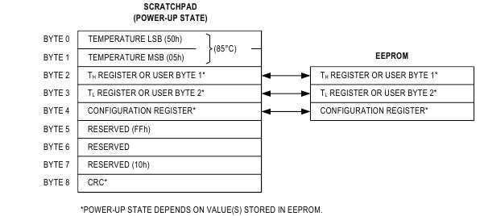

# esp8266-platformio
examples for esp8266 ESP-01 board on PlatformIO

Чтобы составлять заметки, воспользуемся следующим инструментарием:

- [**Markdown**](https://daringfireball.net/projects/markdown/) is a text-to-HTML conversion tool for web writers. 

- [**Showdown**](https://github.com/showdownjs/showdown) is a Javascript Markdown to HTML converter.

# ESP8266 pins list function, register, strapping

ESP8266 pins [list function, register, strapping](https://esp8266.ru/esp8266-pin-register-strapping/)

Pins functions:


# Memory Map 
см. [https://github.com/esp8266/esp8266-wiki/wiki/Memory-Map](https://github.com/esp8266/esp8266-wiki/wiki/Memory-Map)

# ESP8266 ESP-01

Модуль ESP-01 содержит микроконтроллер ESP8266 (Processor	Tensilica L106 32 bit, with on-chip SRAM, on top of its Wi-Fi functionalities) и чип flash-памяти 1MB (EEPROM — Electrically Erasable Programmable Read-Only Memory — электрически стираемое перепрограммируемое ПЗУ). 


В нижней части модуля ESP-01 находятся восемь контактов. 

На ESP-01 есть два светодиода: 
- красный - указывает на наличие питания
- синий - указывает на наличие потока данных и может также управляться программно пользователем (pin GPIO1 (TX))


Напряжение питания модуля 3,3 вольта (предельные значения 2,5 - 3,6 вольт).
Прежде чем подключать модуль к компьютеру через USB-TTL конвертер необходимо установить перемычку на плате конвертера в положение 3,3В. 
Подача 5В на контакты выведет модуль из строя.

Максимально допустимый ток на контактах ввода/вывода 15 мА.
Величина тока, необходимого во время работы Wi-Fi, до 500 мА.

## Default Connection Parameters
```
- SSID: ESP_XXXXXX (XXXXXX are the last 6 characters of module’s MAC address) 
- Encryption: WPA/WPA2 
- Serial Parameters: 74880, 8, 1, None 
- Mode: SoftAP (Access Point)
- IP Address: 192.168.4.1
```

## Basic AT Instructions 
```
AT                Test AT startup
AT+RST            Restart module
AT+GMR            View version info 
AT+CWMODE=<mode>  Set Wi-Fi <mode> 1:Station 2:AP 3:Both
AT+CWLAP          List AP
AT+CWJAP=<ssid>,<pwd>  Join AP
AT+CWQAP          Disconnect from AP
AT+CWLIF          Check IP address of connected device
AT+CIPSR          Get local IP address (Station mode)
```

## Схема программирования


Собираем схему программирования ESP-01, ещё раз проверяем всё ли верно, подаём питание и подключаем через USB-TTL конвертер к компьютеру. 

Кнопка `Reset` служит для перезапуска программы модуля. Для перезапуска необходимо нажать и отпустить кнопку `Reset`, при этом контакт `RST` кратковременно замыкается на `GND`. По действию это эквивалентно отключению/подключению питания модуля.

Если в момент кратковременного нажатия на кнопку `Reset`, а точнее, в момент отпускания кнопки `Reset`, или во время подачи питания на модуль, кнопка `Flash` нажата, то есть контакт `GPIO0` заземлён на `GND`, модуль входит в режим прошивки (программирования).

## Шина I2C

Для работы с LCD 16x2 необходимо подключить шину I2C дисплея к модулю ESP-01 по следующей схеме:


Пример кода находится в файле ``nodeMCU/lcdprint.lua`` .

## Терминал

Для связи с оборудованием, подключённым к последовательныму COM-порту, необходима терминальная программа.

- [**PuTTY**](https://www.chiark.greenend.org.uk/~sgtatham/putty/) — свободно распространяемый клиент на Windows и Unix платформы для различных протоколов удалённого доступа, включая `SSH`, `Telnet`, `rlogin`. Имеется возможность работы через последовательный порт. Можно указывать любые скорости, в том числе 74880 Бод.

- [**CoolTerm**](http://freeware.the-meiers.org/) — программа-терминал под OS Windows для обмена данными с устройствами, подключенными к последовательным портам. Только для OS Windows. Удобней чем PuTTY, однако нет возможности работать на скорости 74880 Бод.

## Flash Download Tool

Для прошивки, загрузки программы во flash-память модуля, нам понадобится `Flash Download Tool`, а также `Software Development Kit`

- [**Flash Download Tool**](https://www.espressif.com/sites/default/files/tools/flash_download_tools_v3.6.5_0.zip) is the *Espressif* official flashing tool for ESP8266

- The non-OS SDK [**ESP8266 NONOS SDK V2.2.1**](https://github.com/espressif/ESP8266_NONOS_SDK/releases/tag/v2.2.1) provides a set of application programming interfaces (APIs) for core ESP8266 functionalities such as data reception/transmission over Wi-Fi, TCP/IP stack functions, hardware interface functions and basic system management functions

### Запускаем Flash Download Tool

- В окне выбора инструмента нажимаем на кнопку `ESP8266 Download Tool`.

- В верхней части основного окна выбираем вкладку `SPIDownload`.
- Выбираем правильные номер `COM` порта и скорость передачи.
- На переключателе `SPI SPEED` выбираем `40MHz` и на переключатель `SPI MODE` - `QIO`.
- На схеме нажимаем и удерживаем кнопку `Flash`; нажимаем, на секунду, и отпускаем кнопку `Reset`; отпускаем кнопку `Flash`.
- Нажимаем кнопку `Start` в левом нижнем углу окна инструмента прошивки.


В результате инструмент загрузки определил размер EEPROM в модуле как 8Mbit, то есть 1 мегабайт, а также частоту кварцевого генератора 26 МГц, и считал MAC-адреса в режимах AP (`Access Point`, точка доступа) и STA (`Station`, станция).

```
flash vendor: 85h : N/A
flash devID: 6014h N/A; 8Mbit 
crystal: 26 Mhz
AP:  86-F3-EB-7F-DB-1E  
STA:  84-F3-EB-7F-DB-1E
```

### Запись на модуль ESP-01 1M

Устанавливаем:
- `CrystalFreq` как `26M`;
- `40MHz` в переключателе `SPI SPEED`;
- `QIO` в переключателе `SPI MODE`;
- `8Mbit` в переключателе `FLASH SIZE`.

### lists the download addresses for non-OTA firmware
```
0x00000 eagle.flash.bin 
0x01000 eagle.irom0text.bin
0xFB000 blank.bin
0xFC000 esp_init_data_default.bin
0xFE000 blank.bin
```

### lists the download addresses for the OTA firmware
```
0x00000 boot.bin 
0x01000 user1.bin
0x81000 user2.bin
0xFB000 blank.bin
0xFC000 esp_init_data_default.bin
0xFE000 blank.bin
```

### Прошивка

- Перезагрузим модуль в режим прошивки (программирования):
    * нажимаем и удерживаем кнопку `Flash`
    * нажимаем, на секунду, и отпускаем кнопку `Reset`
    * отпускаем (или дождаться окончания прошивки) кнопку `Flash`

- Нажимаем кнопку `Start` в левом нижнем углу окна инструмента прошивки.

Ждём окончания процесса перепрограммирования.

- Нажимаем и отпускаем кнопку `Reset` - модуль перезапустится в нормальный режим.

### Проверка успешности прошивки

Запускаем на компьютере терминальную программу `CoolTerm`, где в окне настроек устанавливаем нужный COM порт, и скорость 115200 бод.

Нажимаем и отпускаем кнопку `Reset` - модуль перезапустится в нормальный режим.

Задаём в терминальной программе `CoolTerm` AT-команды модулю ESP-01

```
AT
OK

AT+GMR
AT version:1.6.2.0(Apr 13 2018 11:10:59)
SDK version:2.2.1(6ab97e9)
compile time:Jun  7 2018 19:34:26
Bin version(Wroom 02):1.6.2
OK

AT+CWLAP
+CWLAP:(4,"WiFi-DOM.ru-6957",-47,"8c:68:c8:aa:87:2c",1,113,0,5,3,7,0)
+CWLAP:(4,"Xiaomi_AA6B",-88,"34:ce:00:4a:aa:6c",1,143,0,5,3,7,1)
+CWLAP:(4,"Wive-NG-MT15",-92,"f8:f0:82:1d:16:ad",1,135,0,5,3,7,0)
+CWLAP:(4,"Beeline_2G_FF9431",-89,"d4:60:e3:d9:22:f8",1,112,0,4,3,7,0)
+CWLAP:(3,"ASUS",-92,"04:92:26:3d:22:b8",3,110,0,4,4,7,1)
+CWLAP:(1,"besarab",-70,"00:16:cb:05:80:7c",11,125,0,0,0,3,0)
+CWLAP:(3,"SkyNet20",-56,"54:04:a6:8d:18:a0",6,86,0,4,4,7,1)
+CWLAP:(3,"NorthSide",-74,"64:66:b3:54:09:fa",7,130,0,4,4,7,1)
+CWLAP:(0,"ScrewYou!",-85,"74:da:da:08:ab:f9",11,145,0,0,0,7,0)
+CWLAP:(3,"RT-WiFi_3BDC",-86,"70:2e:22:62:3b:dc",10,130,0,4,4,7,1)
+CWLAP:(3,"Inna64",-87,"90:f6:52:b1:55:84",11,108,0,5,3,7,1)
+CWLAP:(3,"ZimaNET",-86,"c0:25:e9:e3:61:8a",11,117,0,4,4,7,1)
OK
```

# Esptool

Для чтения и записи flash-памяти устройств с микроконтроллерами ESP8266 можно использовать утилиту Esptool, написанную на языке Python, что предполагает наличие последнего на компьютере.

[esptool.py](https://github.com/espressif/esptool) — A Python-based, open source, platform independent, utility to communicate with the ROM bootloader in Espressif ESP8266 & ESP32 chips.

For example

- Determine the Flash Size:
```
esptool.py --port COM4 flash_id
```
- Read 1MB of attached flash:
```
esptool.py --port COM4 read_flash 0x0 0x100000 flash_contents.bin
```
- Write binary data to flash:
```
esptool.py --port COM4 write_flash 0x1000 my_app-0x01000.bin
```
Welcome to the [esptool wiki](https://github.com/espressif/esptool/wiki) !

# dweet.io 
Пригодится, для отладки, [dweet.io](http://dweet.io/) - сервис хранения показаний (dweets) датчиков, без оплаты до 5 dweets хранятся 24 часа.
### write dweet
- request in web brouser
```
https://dweet.io/dweet/for/shs-thing-name?temperature=25.12
```
- or send
```
POST /dweet/for/shs-thing-name HTTP/1.1
Host: dweet.io
Connection: close
Content-Type: application/json
Content-Length: 25

{"temperature": "25.12" }
```
### read dweet(s)

- read the latest dweet 

``https://dweet.io/get/latest/dweet/for/shs-thing-name``

- read all the dweets 

``https://dweet.io/get/dweets/for/shs-thing-name``  

# DS18B20 – датчик температуры с интерфейсом 1-Wire 

Техническая спецификация здесь:  https://datasheets.maximintegrated.com/en/ds/DS18B20.pdf 

По этой ссылке [описание на русском языке.](http://mypractic.ru/ds18b20-datchik-temperatury-s-interfejsom-1-wire-opisanie-na-russkom-yazyke.html)

Для однопроводного интерфейса 1-Wire достаточно одного порта связи с контроллером.
Каждое устройство имеет  уникальный серийный код длиной 64 разряда.
Возможность подключения нескольких датчиков через одну линию связи.
Нет необходимости во внешних компонентах.
Возможность получать питание непосредственно от линии связи. Напряжение питания в пределах 3,0 В … 5,5 В.
Диапазон измерения температуры -55 ... +125 °C.
Погрешность не превышает 0,5 °C в диапазоне -10 ... +85 °C.
Разрешение преобразования 9 … 12 бит. Задается пользователем.

Датчик DS18B20 
- Обменивается данными с микроконтроллером по однопроводной линии связи, используя протокол интерфейса 1-Wire.
- Диапазон измерения температуры составляет от -55 до +125 °C. 
- Для диапазона от -10 до +85 °C погрешность не превышает 0,5 °C.
- Напряжение питания в пределах 3,0 В … 5,5 В.
- Разрешение преобразования 9 … 12 бит, по умолчанию 12 бит.
- Время измерения не превышает 750 мс при максимально возможном разрешении 12 бит.

Сразу после подачи питания на датчик устанавливается:
- разрешение преобразования 12 бит
- в двухбайтном регистре температуры значение 0550h что соответствует 85 градусам

У каждой микросхемы DS18B20 есть уникальный серийный код длиной 64 разряда (8 байт).


Измеренное значение температуры хранится в дополнительном коде в 16-разрядном температурном регистре, в младших двух байтах девятибайтовой оперативной памяти (SRAM) scratchpad . 



## Инициализация – импульсы сброса и присутствия

Любые коммуникационные операции DS18B20 начинаются с последовательности инициализации, которая состоит из импульса сброса от ведущего устройства ведомому, и ответного импульса присутствия из DS18B20. Этот процесс показан на рисунке 13. Термодатчик посылает импульс присутствия в ответ на импульс сброса, чтобы сообщить ведущему устройству, что он подключен к шине и готов к использованию.


Во время последовательности инициализации ведущее устройство передает импульс сброса (Tx), формируя на шине сигнал низкого уровня в течение времени не менее 480 мкс. Далее, ведущее устройство освобождает шину и переходит в режим приема (Rx). Когда шина освобождается, она подтягивается к высокому логическому уровню резистором 5 кОм. Датчик выделяет положительный фронт, ждет 15-60 мкс и передает импульс присутствия, удерживая низкий уровень линии на время 60-240 мкс.

## Временные слоты записи и чтения.

Протокол определяет два типа тайм-слотов записи данных в DS18B20: для записи значения 1 и записи значения 0. Длительность слота записи - не менее 60 мкс с паузой на восстановление между слотами 1,0 мкс, как минимум. Инициируется любой слот записи отрицательным фронтом сигнала шины (рис. 14).

Для формирования слота записи 1, после перевода шины в низкое состояние, ведущее устройство должно освободить шину на время 15 мкс. Подтягивающий резистор 5 кОм создаст на шине напряжение высокого уровня.

Для формирования слота записи 0, после перевода шины в низкое состояние, ведущее устройство должно продолжать удерживать шину в низком состоянии  в продолжение всего времени слота (как минимум 60 мкс).

DS18B20 проверяет состояние сигнала в отрезке времени между 15 и 60 мкс, отсчитывая его от начала слота записи. Состояние шины на этом отрезке соответствует значению бита для записи в датчик.


Длительность слота чтения, как и слота записи, должна быть не менее 60 мкс с паузой на восстановление между слотами 1 мкс, как минимум. Инициируется любой слот чтения отрицательным фронтом сигнала шины (рисунок 14).

После того как ведущее устройство инициализировало слот чтения, DS18B20 передает бит данных.  Для передачи 1 датчик оставляет шину свободной (в высоком состоянии), а для передачи 0 – формирует на шине низкий уровень.

При передаче 0, DS18B20 должен освободить шину в конце слота. Подтягивающий резистор сформирует на ней высокий уровень. Выходные данные DS18B20 достоверны в течение 15 мкс, от начала слота чтения.

- для SDK Arduino библиотека от [Paul Stoffregen](https://github.com/PaulStoffregen/OneWire/blob/master/OneWire.cpp)

- для SDK ESP8266 NON OS библиотека от [Kevin Uhlir](https://github.com/n0bel/esp8266-UdpTemp/blob/master/driver/ds18b20.c) 
или, то же самое, у [Mikhail Grigorev](https://github.com/CHERTS/esp8266-devkit/tree/master/Espressif/examples/ESP8266/1wire_ds18b20)

# VirtualBox & Ubuntu

Краткое руководство по компиляции и загрузки программы [esp8266-sdk getting started guide](https://www.espressif.com/sites/default/files/documentation/2a-esp8266-sdk_getting_started_guide_en.pdf)

Устанавливаем на виртуальной машине VirtualBox образ операционной системы Ubuntu с необходимым инструментарием  [ESP8266\_lubuntu\_20141021.ova](http://downloads.espressif.com/FB/ESP8266_GCC.zip) где пользователь login ``espressif`` password ``espressif``

Скачиваем комплект разработчика [ESP8266\_RTOS\_SDK](https://github.com/espressif/ESP8266_RTOS_SDK)
```
  cd ~/esp
  git clone https://github.com/espressif/ESP8266_RTOS_SDK
```
The toolchain programs access ESP8266\_RTOS\_SDK using ``IDF_PATH`` environment variable.
```
  export IDF_PATH=~/esp/ESP8266_RTOS_SDK
```
Берём пример
```  
  cd ~/esp
  cp -r $IDF_PATH/examples/get-started/project_template .
```  
Транслировать и собрать программу
```  
  cd ~/esp/project_template
  make menuconfig    
  make
```
Загрузить программу в esp8266
```
  make flash
```
Подключить к COM-порту монитор
```
  make monitor
```
To execute ``make flash`` and ``make monitor`` in one go, type ``make flash monitor``.

# VS Code & PlatformIO for Espressif Generic ESP8266 ESP-01 1M board

[Visual Studio Code](https://code.visualstudio.com/) Code editing. Free. Open source. Runs everywhere.

[PlatformIO](https://platformio.org/) is an open source cross-platform build system 
- 600+ embedded boards (Arduino UNO/Nano, ESP8266 ESP-01 1M ..), 
- 30+ development platforms (Atmel AVR, Espressif 8266 ..), 
- 15+ frameworks (Arduino, ESP8266 RTOS SDK, ESP8266 Non-OS SDK ..)
