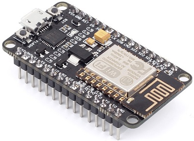
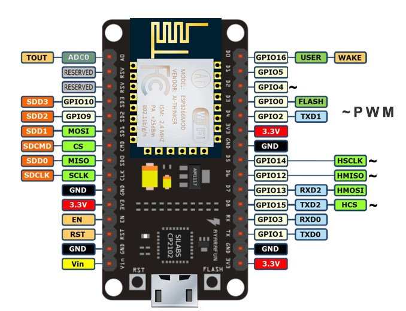
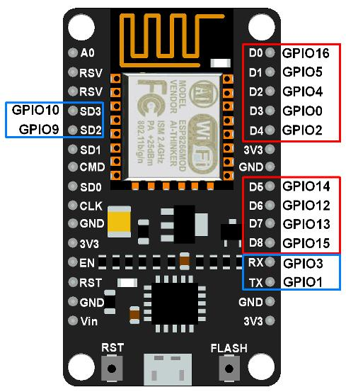

## Lua

Краткий обзор интерпретируемого языка Lua здесь: [http://tylerneylon.com/a/learn-lua/](http://tylerneylon.com/a/learn-lua/),
а полное руководство тут: [http://lua.org.ru/contents_ru.html](http://lua.org.ru/contents_ru.html).
)

## NodeMCU

Открытый бесплатный проект [NodeMCU](https://github.com/nodemcu/nodemcu-firmware) — "прошивка" для микроконтроллера ESP8266 на основе скриптового языка Lua. 

NodeMCU модульная, что позволяет собрать прошивку только из требуемых модулей.
Существует сайт, [https://nodemcu-build.com](https://nodemcu-build.com), на котором можно собрать NodeMCU с необходимыми модулями. 
Исходные коды модулей можно найти здесь:[https://github.com/nodemcu/nodemcu-firmware/tree/master/lua_modules](https://github.com/nodemcu/nodemcu-firmware/tree/master/lua_modules).

Подробная документация по NodeMCU тут: [https://nodemcu.readthedocs.io/en/master/](https://nodemcu.readthedocs.io/en/master/)

Существует одноимённая отладочная плата NodeMCU Development board, или [ESP8266 12-E NodeMCU Kit](https://www.nodemcu.com/index_en.html)




    


Контакты ввода/вывода в устройстве NoddMCU отображаются на внутренние контакты GPIO (General Purpose Input/Output) ESP8266 следующим образом:
```
D0 GPIO16
D1 GPIO5   D3 GPIO0   D5 GPIO14   D7 GPIO13    D9 GPIO3   D11 GPIO9     
D2 GPIO4   D4 GPIO2   D6 GPIO12   D8 GPIO15   D10 GPIO1   D12 GPIO10 
```

Питание модуля NodeMcu, варианты:
```
5-18 В через контакт Vin;
5 В через USB-разъем;
3,3 В через вывод 3V3.
```

Электрические характеристики модуля ESP-12E
```
3.3 V рабочее напряжение
15 mA максимально допустимый ток контакта GPIO
12 - 200 mA ток потребления в рабочем режиме
Less than 200 uA ток потребления в режиме ожидания (standby)
```

## esptool.py

Прошивку NodeMCU можно осуществить с помощью [esptool](https://github.com/espressif/esptool) — а Python-based, open source, platform independent, utility to communicate with the ROM bootloader in Espressif ESP8266 & ESP32 chips.
```
esptool.py --port /dev/ttyUSB0 write_flash 0x00000 The_NodeMCU_Firmware.bin

```
Welcome to the [esptool wiki](https://github.com/espressif/esptool/wiki) !

## ESPlorer

Для написания и заливки Lua-скриптов есть утилита [ESPlorer](http://esp8266.ru/esplorer/) — the essential multiplatforms tools for any ESP8266 developer from luatool author’s, required JAVA (Standard Edition - SE ver 7 and above) installed.
- [ESPlorer source code on GitHub](https://github.com/4refr0nt/ESPlorer)
- [Download ESPlorer.zip](http://esp8266.ru/esplorer-latest/?f=ESPlorer.zip)

## init.lua

При ниличии скрипта с именем ``init.lua`` он стартует автоматически после запуска NodeMCU, а основной скрипт, например, ``main.lua``, запускается из ``init.lua``. При некоторых критических ошибках NodeMCU может перезагружаться. И самое страшное, что может случиться – это циклическая перезагрузка. Поэтому, при отладке кода, лучше запускать скрипты вручную, и только после того как все ошибки будут устранены, добавлять его в ``init.lua``.

Кроме того введём в ``init.lua`` задержку в на запуск основного скрипта. Таким образом, если мы допустим ошибку и NodeMCU уйдет в циклическую перезагрузку, после перезагрузки у нас будет 15 секунд для того чтобы удалить или исправить дефектный скрипт.
```
-- файл init.lua
-- задержка, чтобы скрипт запускался не сразу, а по истечению 15 сек, 
-- в случаи критической ошибки, чтобы исправить ее или удалить скрипт.
local mytimer = tmr.create() -- Создаем таймер
print("Wait... 15s"); 
mytimer:register(15000, tmr.ALARM_SINGLE, function (t) 
  -- таймер выполниться один раз через 15 сек 
  print("Start");
  dofile("example.lua") --Запуск нашего скрипта 
  t:unregister()
end)
mytimer:start()  -- стартуем таймер
```
Смотри также [https://nodemcu.readthedocs.io/en/latest/upload/#initlua](https://nodemcu.readthedocs.io/en/latest/upload/#initlua)
